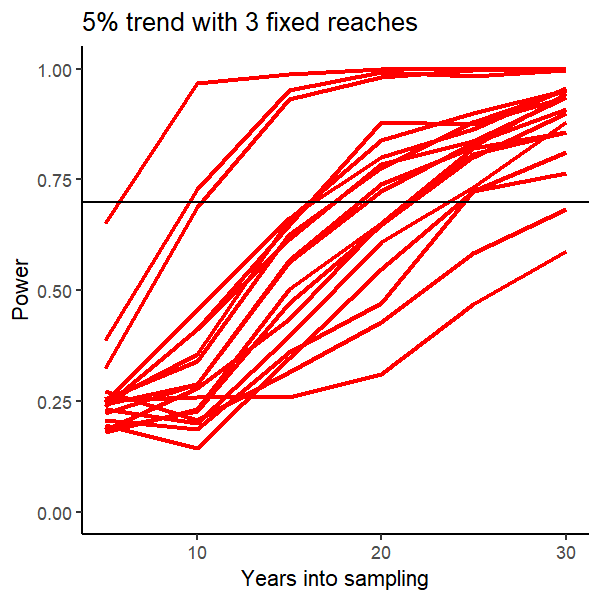

NEON fish population trend analyses
================
Ryan McClure and Jeff Wesner
2024-05-30

## Purpose

This repository quantifies stream fish population trends using the NEON
electrofishing data. The purpose of the repository is five-fold:
- 1: Wrangle the NEON fish data
- 2: Estimate the fish populations using across sites using our own model and logistic models from the `FSA` package. 
- 3: Estimate capture efficiencies using a Bayesian multinomial Poisson model with the `ubms` package
- 4: Run a power analysis that evaluates how changing from 3 fixed reaches to 1 changes the number of years to which a declining annual trend of 5% is signiciantly detected
- 5: Visualize the power analysis

## Data sets

The following NEON data sets are used in this analysis:

- DP1.20107.001 - [Fish electrofishing, gill netting, and fyke netting
  counts](https://data.neonscience.org/data-products/DP1.20107.001)
- DP1.20190.001 - [Reaeration field and lab
  collection](https://data.neonscience.org/data-products/DP1.20190.001)

## 1) Data wrangling
### 1.1) Calculate reach length and wetted width for Power models

NEON records the length (m) of the pass in `DP1.20190.001$fsh_fieldData$measuredReachLength` and the wetted width in the `DP1.20190.001$rea_widthFieldData$wettedWidth.` However, these widths are measured at different times than the electrofishing passes.

To obtain the sampling area, we first get an average wetted width per site (in m). Then we multiply that by the sampled length (in m) to arrive at a sampling area estimate (in $\text{m}^2$). These values are used as a correction factor in the power analysis models. 

### 1.2) Tally total fish numbers from two tables

To get the number of fish caught per pass, we have to combine two data sources in the electrofishing data set (DP1.20107.001): `fsh_perFish` and `fsh_bulkCount`. NEON field scientists measure the first 50 fish from each species per pass and place those
values in `DP1.20107.001$fsh_perFish` table. Field staff then bulk count the rest and places those values in the `DP1.20107.001$fsh_bulkCount` table. Data are then filtered to exclude samples that only contain a single pass. The values can then be combined using their eventID between the tables.

## 2) Estimating fish populations using `FSA` and updated MM model
Script `02_estimate_abundance.R` is designed to quantify abundance using the `FSA` package and our own model that is curently in development. The script starts out by looping through and calculating abundance using all five methods and then outputing the mean estiamte and the 95% CIs. Next, we test a new model that quantifies abundance. Its very much in development right now and is not currently in this analysis. 

## 3) Pulling capture probabilities from STAN model
Script `03_get_capture_probabilities.R` is designed to also quantify abundance using the with a multinomial poisson STAN model that uses reachID and year as model drivers. It takes about 5 minutes to run. It is three chains at about 1500 iterations. The output used is the capture probabilities. 

## 4) Run the power analysis

...

